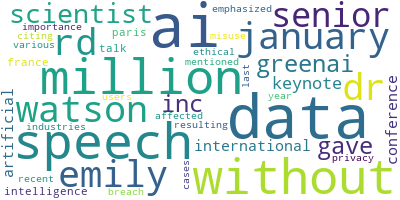

# 📝 Text Preprocessing & NLP (Metin Ön İşleme ve Doğal Dil İşleme Örneği)

Bu proje, bir metin üzerinden **Doğal Dil İşleme (NLP)** adımlarını uygulayarak temel metin ön işleme süreçlerini göstermektedir.  
Metnimiz, **Dr. Watson'ın etik yapay zekanın önemi, açık kaynak araçların NLP'de yarattığı fırsatlar ve yapay zekanın insan merkezli olması gerektiği** üzerine yaptığı konuşmadan alınmıştır.

---

## 📌 İçindekiler

- [Proje Amacı](#-proje-amacı)
- [Kurulum](#-kurulum)
- [Kullanılan Kütüphaneler](#-kullanılan-kütüphaneler)
- [Metin Ön İşleme Teorik Bilgi](#-metin-ön-i̇şleme-teorik-bilgi)
  - [Stopwords Removing](#-stopwords-removing)
  - [Tokenization](#-tokenization)
  - [Stemming](#-stemming)
  - [Lemmatization](#-lemmatization)
  - [Part-of-Speech (POS) Tagging](#-part-of-speech-pos-tagging)
  - [Named Entity Recognition (NER)](#-named-entity-recognition-ner)
  - [Word Frequency Count](#-word-frequency-count)
- [Görselleştirme](#-görselleştirme)
- [Çalıştırma](#-çalıştırma)
- [Geliştirici](#-geliştirici)

---

## 🎯 Proje Amacı

Bu proje, **temel metin ön işleme tekniklerini** öğretmeyi ve bunların Python ekosistemindeki güçlü kütüphanelerle nasıl uygulanabileceğini göstermeyi amaçlamaktadır. Ayrıca, elde edilen metin özellikleri üzerinden **kelime frekans analizi ve görselleştirme** yapılmıştır.

---

## ⚙️ Kurulum

Projeyi klonladıktan sonra gerekli bağımlılıkları yükleyin:

```bash
git clone <repo-link>
cd <repo-name>
pip install -r requirements.txt
```

## 📚 Kullanılan Kütüphaneler

- NLTK – Tokenization, stopwords, stemming işlemleri için gereklidir
- spaCy – Lemmatization, POS tagging, NER işlemleri için gereklidir.
- Pandas – Veri işleme işlemi için önemlidir
- Matplotlib & Seaborn – WordCount ile görselleştirmede yardımcı olmaktadır
- WordCloud – Kelime bulutu oluşturmada kullanılmaktadır
- Scikit-learn – Ek metin işleme araçlarına (CountVectorizer gibi) imkan sunmaktadır.

## 📊 Görselleştirme

- Kelime frekansı bar grafiği (en sık geçen kelimeler)
- Kelime bulutu (Word Cloud) ile kelimelerin yoğunluk dağılımları



## Özellikler

- Stopwords temizleme

- Tokenizasyon (cümle ve kelime bazlı tokenlaştırma)

- Stemming ve Lemmanization ile gövde bulma

- POS tagging ve NER (Named Entity Recognition) ile cümlenin ögelerinin ve varlıkların bulunması

- Kelimelerin frekanslarının bulunması ve görselleştirilmesi

## ▶️ Çalıştırma

Jupyter Notebook veya Python dosyasını çalıştırarak sonuçları görebilirsiniz:

```bash
jupyter notebook text_preprocessing.ipynb

veya

python main.py

```

## 👨‍💻 Geliştirici

- **Ad:** UstubecEmre

- **E-posta:** emresb1999@gmail.com

Not: Herhangi bir sorunuz veya geliştirme öneriniz olursa çekinmeden benimle iletişime geçebilirsiniz.
